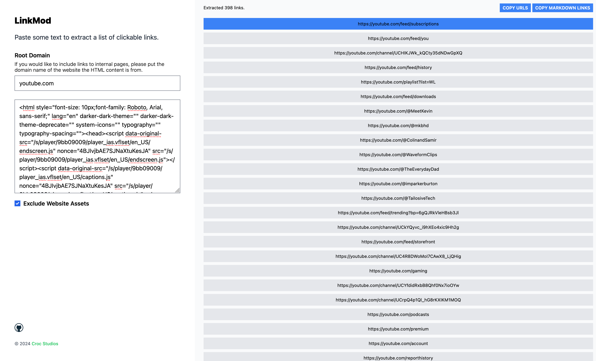

# LinkMod

This is a simple web app that you can install on your device. 

It works offline.

You simply paste some text or HTML and it extracts all the internal and external URLs and renders them as a clean list of clickable/tappable links.

